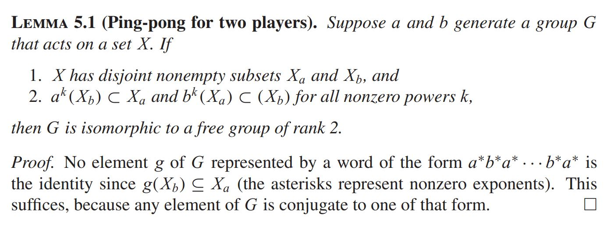
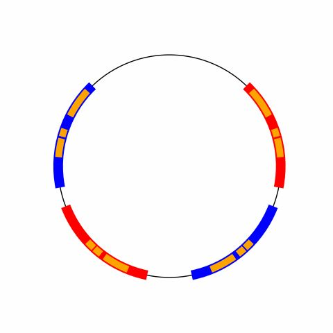

# Texas Experimental Geometry Lab
This is the code repository for UT Austin's TXGL Project 2 (https://sites.cns.utexas.edu/geometry_lab/project-2)

In this project, we study the actions of SL2(R) matrix groups on RP1. Given a finitely presented group G, we want to algorithmically determine whether the homomorphism from G into one of these matric groups is faithful.

## Faithful Group Actions
A group action is considered faithful if there are no elements g in G for which gx = x other than the identity. We can naively check if the action of a group is non-faithful by recursively checking if any word made by the generators is the identity (search the Cayley graph until we find some product of generators which gives us 1). This method will not work if we are given a faithful group action though, since we will never find such a word.

## Ping Pong Lemma
With the use of a very powerful lemma, we can solve this problem. The Ping Pong Lemma essentailly tells us that if we can find some collection of disjoint sets of RP1 depending on G, we are able to make a finite number of calculations to determine that the group action is faithful.

  

Our algorithm can now search for these collections of intervals and then check the conditions of the lemma instead of using the brute force approach. There are some things we know about the intervals which lowers the number of cases we need to search but we will not enumerate all of them here. One example is that the intervals must contain the eigenvectors of the matrix generators.

Below is an example of such intervals in RP1 which contain the images of the other intervals. Since these are disjoint and we have full containment, we know that the matrices corresponding to these intervals generate a group with a faithful action on RP1.

  

## The Code
The main program to look at in this repository is generalized_search.py. To test the algorithm on a free group of n generators, change the line in main 'generators = free_group_generators(6, val = 0.5)' to include the number of generators you want followed by the range of values you want to appear in the randomly generated matrices.
